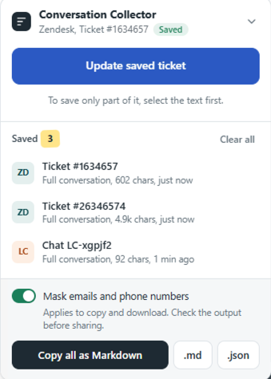

# Zendesk & LiveChat Collector

When I'm reviewing support work, I often need to collect several tickets or chats before I can review them together.

Sometimes I need the whole conversation. Sometimes I only need one part of it.

Doing that manually means selecting text, copying it somewhere else, cleaning it up, moving to the next ticket or chat, and repeating the same steps again.

So I made **Zendesk & LiveChat Collector**.

It lets me save a whole ticket or chat in one click, or just the text I select. I can keep collecting while I move between conversations, then copy everything together as clean Markdown when I'm ready to review it or give it to AI for analysis.

It can also mask emails and phone numbers in the exported content. The masking is a convenience check, not a complete privacy filter, so the output should still be reviewed before sharing.



---

## How to Use It

This is a Tampermonkey userscript.

### 1. Install Tampermonkey

Install **Tampermonkey** in your browser if you do not already have it.

### 2. Add the script

Open Tampermonkey and create a new userscript.

Then open:

`conversation-collector.user.js`

Copy the full script into the Tampermonkey editor and save it.

### 3. Open Zendesk or LiveChat

Open a Zendesk ticket or LiveChat conversation.

The **Conversation Collector** will appear on the page.

### 4. Collect what you need

To save the whole conversation, click:

- **Save this ticket** in Zendesk
- **Save this chat** in LiveChat

If you only need part of the conversation, select the text first and save the selected text instead.

You can keep moving between tickets and chats and add more items to the same saved list.

### 5. Copy or download everything together

When you're ready, open the collector and:

- **Copy all as Markdown**
- Download a `.md` file
- Download a `.json` file

If **Mask emails and phone numbers** is turned on, the script masks likely email addresses and phone numbers when you copy or download the content.

Always check the output before sharing it.

## Keyboard Shortcuts

You can also use:

- **Alt + Shift + C** — save the current ticket or chat
- **Alt + Shift + S** — save selected text

On Mac, the interface shows the equivalent Option + Shift shortcuts.

## What It Works With

The script currently works with:

- Zendesk Agent ticket pages
- LiveChat
- LiveChat Inc

It reads the conversation already visible on the page and keeps the items you collect through Tampermonkey while you move between supported pages.

Because Zendesk and LiveChat can change their page structure, the script may need to be updated if either interface changes.

## What's in This Repo

```text
support-ticket-chat-collector/
├── conversation-collector.user.js
├── images/
│   └── collector-panel.png
└── README.md
```

`conversation-collector.user.js` is the complete userscript.

`images/collector-panel.png` is the interface screenshot used in this README.
